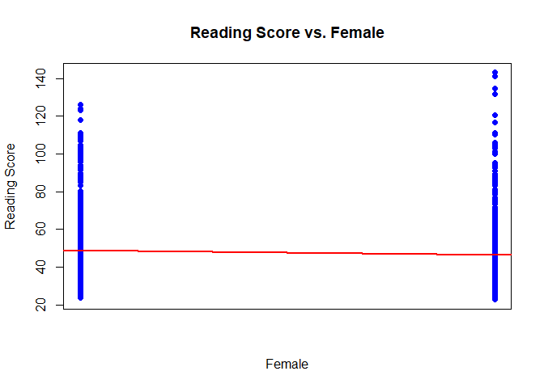
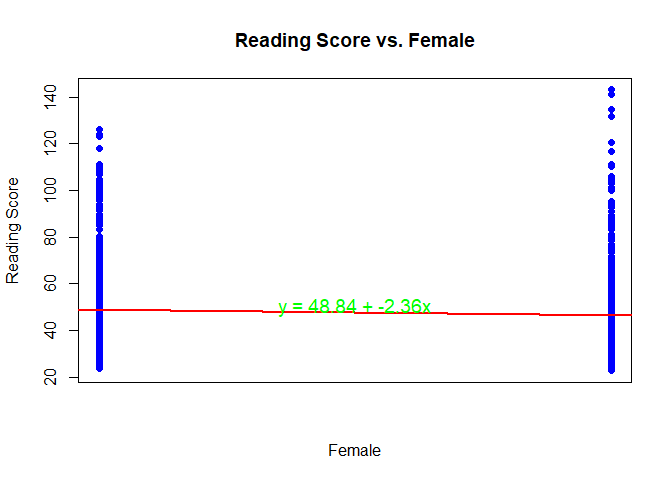

Linear Regression
================
Kerrie Stewart

``` r
eclsk <- read.csv("eclsk.csv")
```

``` r
library(rstanarm)
```

    ## Loading required package: Rcpp

    ## This is rstanarm version 2.32.1

    ## - See https://mc-stan.org/rstanarm/articles/priors for changes to default priors!

    ## - Default priors may change, so it's safest to specify priors, even if equivalent to the defaults.

    ## - For execution on a local, multicore CPU with excess RAM we recommend calling

    ##   options(mc.cores = parallel::detectCores())

``` r
library(rstan)
```

    ## Loading required package: StanHeaders

    ## 
    ## rstan version 2.32.6 (Stan version 2.32.2)

    ## For execution on a local, multicore CPU with excess RAM we recommend calling
    ## options(mc.cores = parallel::detectCores()).
    ## To avoid recompilation of unchanged Stan programs, we recommend calling
    ## rstan_options(auto_write = TRUE)
    ## For within-chain threading using `reduce_sum()` or `map_rect()` Stan functions,
    ## change `threads_per_chain` option:
    ## rstan_options(threads_per_chain = 1)

    ## Do not specify '-march=native' in 'LOCAL_CPPFLAGS' or a Makevars file

## Regression Model

``` r
Model <- stan_glm(read ~ female, data=eclsk)
```

    ## 
    ## SAMPLING FOR MODEL 'continuous' NOW (CHAIN 1).
    ## Chain 1: 
    ## Chain 1: Gradient evaluation took 8.1e-05 seconds
    ## Chain 1: 1000 transitions using 10 leapfrog steps per transition would take 0.81 seconds.
    ## Chain 1: Adjust your expectations accordingly!
    ## Chain 1: 
    ## Chain 1: 
    ## Chain 1: Iteration:    1 / 2000 [  0%]  (Warmup)
    ## Chain 1: Iteration:  200 / 2000 [ 10%]  (Warmup)
    ## Chain 1: Iteration:  400 / 2000 [ 20%]  (Warmup)
    ## Chain 1: Iteration:  600 / 2000 [ 30%]  (Warmup)
    ## Chain 1: Iteration:  800 / 2000 [ 40%]  (Warmup)
    ## Chain 1: Iteration: 1000 / 2000 [ 50%]  (Warmup)
    ## Chain 1: Iteration: 1001 / 2000 [ 50%]  (Sampling)
    ## Chain 1: Iteration: 1200 / 2000 [ 60%]  (Sampling)
    ## Chain 1: Iteration: 1400 / 2000 [ 70%]  (Sampling)
    ## Chain 1: Iteration: 1600 / 2000 [ 80%]  (Sampling)
    ## Chain 1: Iteration: 1800 / 2000 [ 90%]  (Sampling)
    ## Chain 1: Iteration: 2000 / 2000 [100%]  (Sampling)
    ## Chain 1: 
    ## Chain 1:  Elapsed Time: 0.054 seconds (Warm-up)
    ## Chain 1:                0.275 seconds (Sampling)
    ## Chain 1:                0.329 seconds (Total)
    ## Chain 1: 
    ## 
    ## SAMPLING FOR MODEL 'continuous' NOW (CHAIN 2).
    ## Chain 2: 
    ## Chain 2: Gradient evaluation took 1.8e-05 seconds
    ## Chain 2: 1000 transitions using 10 leapfrog steps per transition would take 0.18 seconds.
    ## Chain 2: Adjust your expectations accordingly!
    ## Chain 2: 
    ## Chain 2: 
    ## Chain 2: Iteration:    1 / 2000 [  0%]  (Warmup)
    ## Chain 2: Iteration:  200 / 2000 [ 10%]  (Warmup)
    ## Chain 2: Iteration:  400 / 2000 [ 20%]  (Warmup)
    ## Chain 2: Iteration:  600 / 2000 [ 30%]  (Warmup)
    ## Chain 2: Iteration:  800 / 2000 [ 40%]  (Warmup)
    ## Chain 2: Iteration: 1000 / 2000 [ 50%]  (Warmup)
    ## Chain 2: Iteration: 1001 / 2000 [ 50%]  (Sampling)
    ## Chain 2: Iteration: 1200 / 2000 [ 60%]  (Sampling)
    ## Chain 2: Iteration: 1400 / 2000 [ 70%]  (Sampling)
    ## Chain 2: Iteration: 1600 / 2000 [ 80%]  (Sampling)
    ## Chain 2: Iteration: 1800 / 2000 [ 90%]  (Sampling)
    ## Chain 2: Iteration: 2000 / 2000 [100%]  (Sampling)
    ## Chain 2: 
    ## Chain 2:  Elapsed Time: 0.059 seconds (Warm-up)
    ## Chain 2:                0.287 seconds (Sampling)
    ## Chain 2:                0.346 seconds (Total)
    ## Chain 2: 
    ## 
    ## SAMPLING FOR MODEL 'continuous' NOW (CHAIN 3).
    ## Chain 3: 
    ## Chain 3: Gradient evaluation took 1.8e-05 seconds
    ## Chain 3: 1000 transitions using 10 leapfrog steps per transition would take 0.18 seconds.
    ## Chain 3: Adjust your expectations accordingly!
    ## Chain 3: 
    ## Chain 3: 
    ## Chain 3: Iteration:    1 / 2000 [  0%]  (Warmup)
    ## Chain 3: Iteration:  200 / 2000 [ 10%]  (Warmup)
    ## Chain 3: Iteration:  400 / 2000 [ 20%]  (Warmup)
    ## Chain 3: Iteration:  600 / 2000 [ 30%]  (Warmup)
    ## Chain 3: Iteration:  800 / 2000 [ 40%]  (Warmup)
    ## Chain 3: Iteration: 1000 / 2000 [ 50%]  (Warmup)
    ## Chain 3: Iteration: 1001 / 2000 [ 50%]  (Sampling)
    ## Chain 3: Iteration: 1200 / 2000 [ 60%]  (Sampling)
    ## Chain 3: Iteration: 1400 / 2000 [ 70%]  (Sampling)
    ## Chain 3: Iteration: 1600 / 2000 [ 80%]  (Sampling)
    ## Chain 3: Iteration: 1800 / 2000 [ 90%]  (Sampling)
    ## Chain 3: Iteration: 2000 / 2000 [100%]  (Sampling)
    ## Chain 3: 
    ## Chain 3:  Elapsed Time: 0.051 seconds (Warm-up)
    ## Chain 3:                0.298 seconds (Sampling)
    ## Chain 3:                0.349 seconds (Total)
    ## Chain 3: 
    ## 
    ## SAMPLING FOR MODEL 'continuous' NOW (CHAIN 4).
    ## Chain 4: 
    ## Chain 4: Gradient evaluation took 3e-05 seconds
    ## Chain 4: 1000 transitions using 10 leapfrog steps per transition would take 0.3 seconds.
    ## Chain 4: Adjust your expectations accordingly!
    ## Chain 4: 
    ## Chain 4: 
    ## Chain 4: Iteration:    1 / 2000 [  0%]  (Warmup)
    ## Chain 4: Iteration:  200 / 2000 [ 10%]  (Warmup)
    ## Chain 4: Iteration:  400 / 2000 [ 20%]  (Warmup)
    ## Chain 4: Iteration:  600 / 2000 [ 30%]  (Warmup)
    ## Chain 4: Iteration:  800 / 2000 [ 40%]  (Warmup)
    ## Chain 4: Iteration: 1000 / 2000 [ 50%]  (Warmup)
    ## Chain 4: Iteration: 1001 / 2000 [ 50%]  (Sampling)
    ## Chain 4: Iteration: 1200 / 2000 [ 60%]  (Sampling)
    ## Chain 4: Iteration: 1400 / 2000 [ 70%]  (Sampling)
    ## Chain 4: Iteration: 1600 / 2000 [ 80%]  (Sampling)
    ## Chain 4: Iteration: 1800 / 2000 [ 90%]  (Sampling)
    ## Chain 4: Iteration: 2000 / 2000 [100%]  (Sampling)
    ## Chain 4: 
    ## Chain 4:  Elapsed Time: 0.054 seconds (Warm-up)
    ## Chain 4:                0.277 seconds (Sampling)
    ## Chain 4:                0.331 seconds (Total)
    ## Chain 4:

``` r
summary(Model)
```

    ## 
    ## Model Info:
    ##  function:     stan_glm
    ##  family:       gaussian [identity]
    ##  formula:      read ~ female
    ##  algorithm:    sampling
    ##  sample:       4000 (posterior sample size)
    ##  priors:       see help('prior_summary')
    ##  observations: 2435
    ##  predictors:   2
    ## 
    ## Estimates:
    ##               mean   sd   10%   50%   90%
    ## (Intercept) 48.8    0.4 48.3  48.8  49.3 
    ## female      -2.4    0.6 -3.1  -2.4  -1.6 
    ## sigma       14.3    0.2 14.0  14.3  14.6 
    ## 
    ## Fit Diagnostics:
    ##            mean   sd   10%   50%   90%
    ## mean_PPD 47.7    0.4 47.2  47.7  48.2 
    ## 
    ## The mean_ppd is the sample average posterior predictive distribution of the outcome variable (for details see help('summary.stanreg')).
    ## 
    ## MCMC diagnostics
    ##               mcse Rhat n_eff
    ## (Intercept)   0.0  1.0  4185 
    ## female        0.0  1.0  4288 
    ## sigma         0.0  1.0  4153 
    ## mean_PPD      0.0  1.0  4098 
    ## log-posterior 0.0  1.0  1803 
    ## 
    ## For each parameter, mcse is Monte Carlo standard error, n_eff is a crude measure of effective sample size, and Rhat is the potential scale reduction factor on split chains (at convergence Rhat=1).

## R Squared

``` r
r_squared_post <- bayes_R2(Model)
```

``` r
mean_r_squared <- mean(r_squared_post)
```

``` r
print(mean_r_squared)
```

    ## [1] 0.007136337

## Scatterplot

``` r
plot(eclsk$female, eclsk$read, 
     xlab = "Female", ylab = "Reading Score", 
     main = "Reading Score vs. Female", 
     pch = 19, col = "blue", 
     xaxt = "n") 
abline(Model, col = "red", lwd = 2)
```

<!-- -->

## Plot with Equation

``` r
intercept <- coef(Model)[1]
coefficient <- coef(Model)[2]
```

``` r
equation <- paste("y = ", round(intercept, 2), " + ", round(coefficient, 2), "x", sep = "")
```

``` r
plot(eclsk$female, eclsk$read, 
     xlab = "Female", ylab = "Reading Score", 
     main = "Reading Score vs. Female", 
     pch = 19, col = "blue", 
     xaxt = "n") 
abline(Model, col = "red", lwd = 2)
text(0.5, 50, labels = equation, col = 'green', cex = 1.2)
```

<!-- -->

## Interpretation

The model estimates the relationship between gender and reading scores.
y is the reading score (dependent variable). Gender is measured as a
binary variable where students are coded as either female (1) or not
female (0). The intercept, the reading score for a student who is not
female, is predicted to be 48.83. The slope (-2.36) indicates that being
female is associated with a decrease of 2.36 points in the reading
score, on average, compared to students who are not female. This model
suggests that female students have lower reading scores, on average ,
than non-female students. The R squared value is 0.0072 indicating that
only 0.72% of the variance in reading scores is explained by whether a
student is female or not. This low R squared suggests that gender is not
a predictor of reading scores, or this model is not a good fit.
