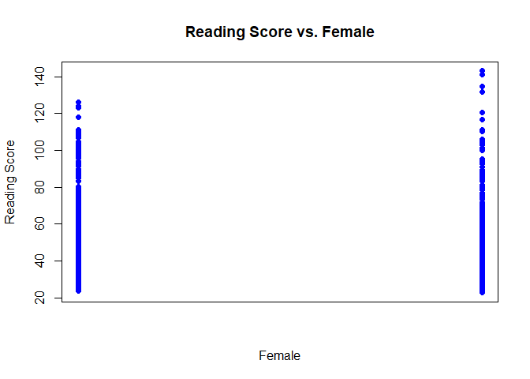

Untitled
================

``` r
eclsk <- read.csv("eclsk.csv")
```

``` r
library(rstanarm)
```

    ## Loading required package: Rcpp

    ## This is rstanarm version 2.32.1

    ## - See https://mc-stan.org/rstanarm/articles/priors for changes to default priors!

    ## - Default priors may change, so it's safest to specify priors, even if equivalent to the defaults.

    ## - For execution on a local, multicore CPU with excess RAM we recommend calling

    ##   options(mc.cores = parallel::detectCores())

``` r
library(rstan)
```

    ## Loading required package: StanHeaders

    ## 
    ## rstan version 2.32.6 (Stan version 2.32.2)

    ## For execution on a local, multicore CPU with excess RAM we recommend calling
    ## options(mc.cores = parallel::detectCores()).
    ## To avoid recompilation of unchanged Stan programs, we recommend calling
    ## rstan_options(auto_write = TRUE)
    ## For within-chain threading using `reduce_sum()` or `map_rect()` Stan functions,
    ## change `threads_per_chain` option:
    ## rstan_options(threads_per_chain = 1)

    ## Do not specify '-march=native' in 'LOCAL_CPPFLAGS' or a Makevars file

## GitHub Documents

This is an R Markdown format used for publishing markdown documents to
GitHub. When you click the **Knit** button all R code chunks are run and
a markdown file (.md) suitable for publishing to GitHub is generated.

## Including Code

You can include R code in the document as follows:

``` r
readscoremodel <- stan_glm(read ~ female, data=eclsk)
```

    ## 
    ## SAMPLING FOR MODEL 'continuous' NOW (CHAIN 1).
    ## Chain 1: 
    ## Chain 1: Gradient evaluation took 0.005495 seconds
    ## Chain 1: 1000 transitions using 10 leapfrog steps per transition would take 54.95 seconds.
    ## Chain 1: Adjust your expectations accordingly!
    ## Chain 1: 
    ## Chain 1: 
    ## Chain 1: Iteration:    1 / 2000 [  0%]  (Warmup)
    ## Chain 1: Iteration:  200 / 2000 [ 10%]  (Warmup)
    ## Chain 1: Iteration:  400 / 2000 [ 20%]  (Warmup)
    ## Chain 1: Iteration:  600 / 2000 [ 30%]  (Warmup)
    ## Chain 1: Iteration:  800 / 2000 [ 40%]  (Warmup)
    ## Chain 1: Iteration: 1000 / 2000 [ 50%]  (Warmup)
    ## Chain 1: Iteration: 1001 / 2000 [ 50%]  (Sampling)
    ## Chain 1: Iteration: 1200 / 2000 [ 60%]  (Sampling)
    ## Chain 1: Iteration: 1400 / 2000 [ 70%]  (Sampling)
    ## Chain 1: Iteration: 1600 / 2000 [ 80%]  (Sampling)
    ## Chain 1: Iteration: 1800 / 2000 [ 90%]  (Sampling)
    ## Chain 1: Iteration: 2000 / 2000 [100%]  (Sampling)
    ## Chain 1: 
    ## Chain 1:  Elapsed Time: 0.073 seconds (Warm-up)
    ## Chain 1:                0.293 seconds (Sampling)
    ## Chain 1:                0.366 seconds (Total)
    ## Chain 1: 
    ## 
    ## SAMPLING FOR MODEL 'continuous' NOW (CHAIN 2).
    ## Chain 2: 
    ## Chain 2: Gradient evaluation took 2.5e-05 seconds
    ## Chain 2: 1000 transitions using 10 leapfrog steps per transition would take 0.25 seconds.
    ## Chain 2: Adjust your expectations accordingly!
    ## Chain 2: 
    ## Chain 2: 
    ## Chain 2: Iteration:    1 / 2000 [  0%]  (Warmup)
    ## Chain 2: Iteration:  200 / 2000 [ 10%]  (Warmup)
    ## Chain 2: Iteration:  400 / 2000 [ 20%]  (Warmup)
    ## Chain 2: Iteration:  600 / 2000 [ 30%]  (Warmup)
    ## Chain 2: Iteration:  800 / 2000 [ 40%]  (Warmup)
    ## Chain 2: Iteration: 1000 / 2000 [ 50%]  (Warmup)
    ## Chain 2: Iteration: 1001 / 2000 [ 50%]  (Sampling)
    ## Chain 2: Iteration: 1200 / 2000 [ 60%]  (Sampling)
    ## Chain 2: Iteration: 1400 / 2000 [ 70%]  (Sampling)
    ## Chain 2: Iteration: 1600 / 2000 [ 80%]  (Sampling)
    ## Chain 2: Iteration: 1800 / 2000 [ 90%]  (Sampling)
    ## Chain 2: Iteration: 2000 / 2000 [100%]  (Sampling)
    ## Chain 2: 
    ## Chain 2:  Elapsed Time: 0.073 seconds (Warm-up)
    ## Chain 2:                0.337 seconds (Sampling)
    ## Chain 2:                0.41 seconds (Total)
    ## Chain 2: 
    ## 
    ## SAMPLING FOR MODEL 'continuous' NOW (CHAIN 3).
    ## Chain 3: 
    ## Chain 3: Gradient evaluation took 3e-05 seconds
    ## Chain 3: 1000 transitions using 10 leapfrog steps per transition would take 0.3 seconds.
    ## Chain 3: Adjust your expectations accordingly!
    ## Chain 3: 
    ## Chain 3: 
    ## Chain 3: Iteration:    1 / 2000 [  0%]  (Warmup)
    ## Chain 3: Iteration:  200 / 2000 [ 10%]  (Warmup)
    ## Chain 3: Iteration:  400 / 2000 [ 20%]  (Warmup)
    ## Chain 3: Iteration:  600 / 2000 [ 30%]  (Warmup)
    ## Chain 3: Iteration:  800 / 2000 [ 40%]  (Warmup)
    ## Chain 3: Iteration: 1000 / 2000 [ 50%]  (Warmup)
    ## Chain 3: Iteration: 1001 / 2000 [ 50%]  (Sampling)
    ## Chain 3: Iteration: 1200 / 2000 [ 60%]  (Sampling)
    ## Chain 3: Iteration: 1400 / 2000 [ 70%]  (Sampling)
    ## Chain 3: Iteration: 1600 / 2000 [ 80%]  (Sampling)
    ## Chain 3: Iteration: 1800 / 2000 [ 90%]  (Sampling)
    ## Chain 3: Iteration: 2000 / 2000 [100%]  (Sampling)
    ## Chain 3: 
    ## Chain 3:  Elapsed Time: 0.06 seconds (Warm-up)
    ## Chain 3:                0.337 seconds (Sampling)
    ## Chain 3:                0.397 seconds (Total)
    ## Chain 3: 
    ## 
    ## SAMPLING FOR MODEL 'continuous' NOW (CHAIN 4).
    ## Chain 4: 
    ## Chain 4: Gradient evaluation took 2.8e-05 seconds
    ## Chain 4: 1000 transitions using 10 leapfrog steps per transition would take 0.28 seconds.
    ## Chain 4: Adjust your expectations accordingly!
    ## Chain 4: 
    ## Chain 4: 
    ## Chain 4: Iteration:    1 / 2000 [  0%]  (Warmup)
    ## Chain 4: Iteration:  200 / 2000 [ 10%]  (Warmup)
    ## Chain 4: Iteration:  400 / 2000 [ 20%]  (Warmup)
    ## Chain 4: Iteration:  600 / 2000 [ 30%]  (Warmup)
    ## Chain 4: Iteration:  800 / 2000 [ 40%]  (Warmup)
    ## Chain 4: Iteration: 1000 / 2000 [ 50%]  (Warmup)
    ## Chain 4: Iteration: 1001 / 2000 [ 50%]  (Sampling)
    ## Chain 4: Iteration: 1200 / 2000 [ 60%]  (Sampling)
    ## Chain 4: Iteration: 1400 / 2000 [ 70%]  (Sampling)
    ## Chain 4: Iteration: 1600 / 2000 [ 80%]  (Sampling)
    ## Chain 4: Iteration: 1800 / 2000 [ 90%]  (Sampling)
    ## Chain 4: Iteration: 2000 / 2000 [100%]  (Sampling)
    ## Chain 4: 
    ## Chain 4:  Elapsed Time: 0.109 seconds (Warm-up)
    ## Chain 4:                0.302 seconds (Sampling)
    ## Chain 4:                0.411 seconds (Total)
    ## Chain 4:

``` r
print(readscoremodel)
```

    ## stan_glm
    ##  family:       gaussian [identity]
    ##  formula:      read ~ female
    ##  observations: 2435
    ##  predictors:   2
    ## ------
    ##             Median MAD_SD
    ## (Intercept) 48.8    0.4  
    ## female      -2.4    0.6  
    ## 
    ## Auxiliary parameter(s):
    ##       Median MAD_SD
    ## sigma 14.3    0.2  
    ## 
    ## ------
    ## * For help interpreting the printed output see ?print.stanreg
    ## * For info on the priors used see ?prior_summary.stanreg

## Scatterplot

``` r
plot(eclsk$female, eclsk$read, 
     xlab = "Female", ylab = "Reading Score", 
     main = "Reading Score vs. Female", 
     pch = 19, col = "blue", 
     xaxt = "n") 
```

<!-- -->

Note that the `echo = FALSE` parameter was added to the code chunk to
prevent printing of the R code that generated the plot.
