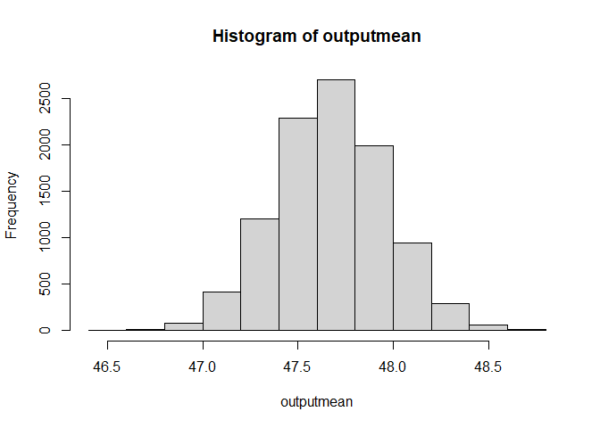
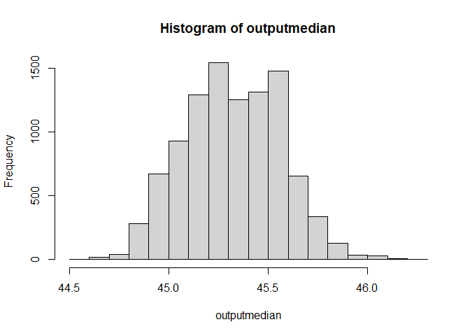

Simulation DV
================

## Conceptual Definition

Assessment of student learning and literacy

## Operational Definition

Student reading scores

``` r
eclsk <- read.csv("eclsk.csv")
```

``` r
boot_score <- function(data){
n <- nrow(data)
boot <- sample(1:n, replace=TRUE)
read_boot <- data$read[boot]
mean(read_boot)
}
```

``` r
n_sims <- 10000
outputmean <- replicate(n_sims, boot_score(data=eclsk))
```

``` r
hist(outputmean)
```

<!-- -->

``` r
print(sd(outputmean))
```

    ## [1] 0.2899858

``` r
boot_score <- function(data){
n <- nrow(data)
boot <- sample(1:n, replace=TRUE)
read_boot <- data$read[boot]
median(read_boot)
}

n_sims <- 10000
outputmedian <- replicate(n_sims, boot_score(data=eclsk))

hist(outputmedian)
```

<!-- -->
